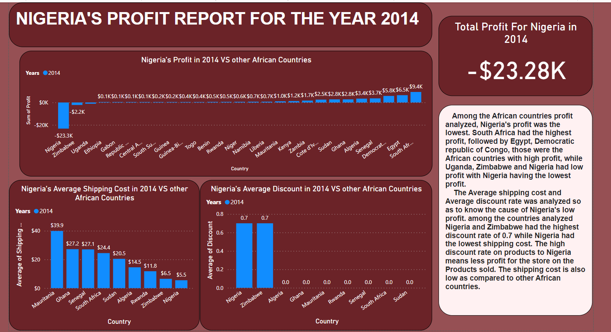
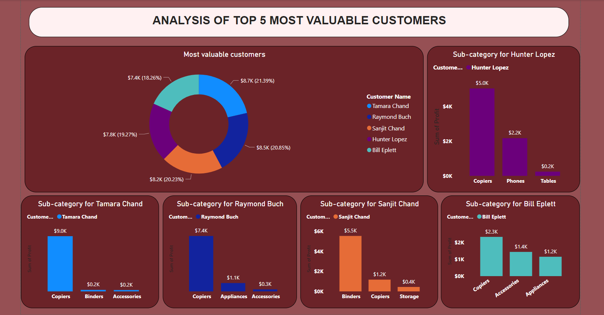

# Global Superstore Analysis

## Introduction

This is a PowerBI project on sales analysis on an imaginary **Global Superstore**. 
The project is to analyze and answer essential questions, enhance performance and profitability, extract meaningful insights, and help the store make data-driven decisions.
Global Superstore is a global online retailer based in New York, boasting a broad product catalog and aiming to be a one-stop-shop for its customers. 

_** Disclaimer**_ : _All dataset does not represent any company or institution but just mock up datasets to demonstarate capabilities of Power BI_

## Problem Statement

1. What are the top three countries with the highest total profit and their most profitable products in 2014 
2. Identify the 3 subcategories with the highest average shipping cost in the United States
3. Assess Nigeria’s profitability for 2014 comparint it to other African countries and analyzing potential factors influencing its performance
4. Identify the product subcategory that is the least profitable in Southeast Asia and evaluating whether the product should be discontinued in a specific country within the region
5.  Which city is the least profitable in the United States (excluding cities with less than 10 orders) and evaluating the underlying reasons for its low profitability
6.  Which product subcategory has the highest average profit in Australia
7.  Who are the most valuable customers and what do they purchase

## Skills Demonstrated

- Power Query
- Data Modeling
- Data Cleaning
- Data Visualization
- Knowledge of generating actionable insights

## Visualization and Analysis

The report consists of five pages:

- **Home page** (Top-Performing Countries and Products)
  

- **USA**
  

- **Nigeria's Profit**
  

- **Subcategories in Southeast Asia**
  

-  **Top 5 Customers**
  

## Recomendations

- Emphasize expanding business by incorporating market and sales strategies in the United States, India, and China to further increase their profiability.

- Evaluate prices and adjust high shipping costs and discounts, particularly in Nigeria to increase profitability.

- Evaluate discounts and shipping costs across regions, put in place specific policies on prices and improving shipping routes to reduce costs.

- Put in place customer satisfaction strategy or customer relationship management (CRM) system to keep record of customer data and use the data of the most profitable customers to attract and retain customers.

- Consider promoting 'Appliances' in Australia by expanding product offerings, enhancing marketing efforts, and exploring partnerships with Retailers.

- Consider stoppage of Tables to Indonesia as it is yielding negative profit to the company

- Regularly monitor and adapt to changing market dynamics by Continuing utilization of data analytics tools and insights to make informed business decisions and strategies to improve profitability.

## Thank You!!! 😃 

**Feel free to Connect with me [here](https://www.linkedin.com/in/muinat-oluwadamilola-alli/)**

